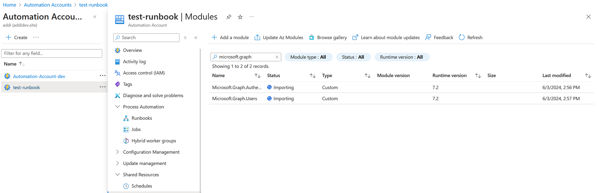
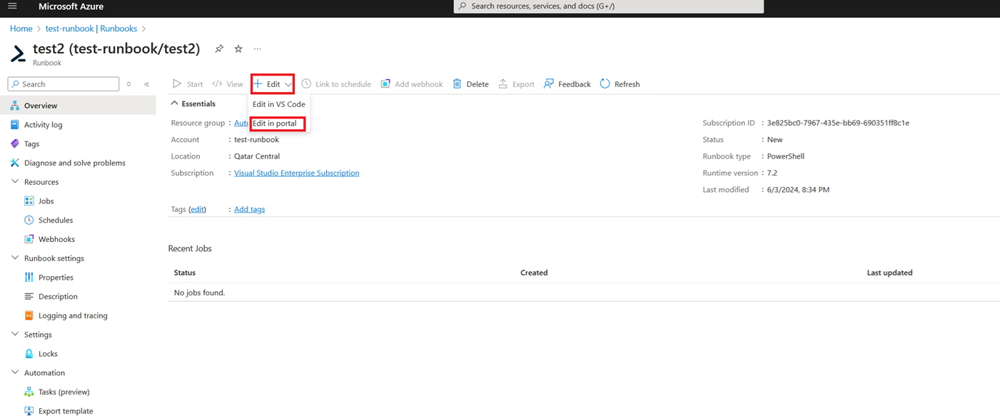

# Calling Graph API from PowerShell runbook in Azure Automation via User Assigned Managed Identity

This tutorial walks you through the creation of a PowerShell runbook in Azure Automation and using user-assigned managed identity for authentication with Graph SDK fpr PowerShell. PowerShell runbooks are text runbooks based on Windows PowerShell. You can create and edit the code of the runbook using the text editor in the Azure portal.

## Prerequisites
- An Azure Automation account with at least one user-assigned managed identity.
- Microsoft Graph modules imported into the Automation account.
- Azure VM for PowerShell session.

## Create a user-assigned managed identity.
To create a user-assigned managed identity, you can refer to the following [link](https://learn.microsoft.com/en-us/entra/identity/managed-identities-azure-resources/how-manage-user-assigned-managed-identities?pivots=identity-mi-methods-azp#create-a-user-assigned-managed-identity).

1. Sign in to the Azure portal.
1. In the search box, enter Managed Identities. Under Services, select Managed Identities
1. Select Add, and enter values in the following boxes in the Create User Assigned Managed Identity pane:

    - Subscription: Choose the subscription to create the user-assigned managed identity under.
    - Resource group: Choose a resource group to create the user-assigned managed identity in, or select Create new to create a new resource group.
    - Region: Choose a region to deploy the user-assigned managed identity, for example, **Qatar Central**.
    - Name: Enter the name for your user-assigned managed identity, for example, runbook-test.
1. Select Review + create to review the changes.
1. Select Create.

In order for the newly created user-assigned managed identity to list or read a user-assigned managed identity, your account needs to have either Managed Identity Operator or Managed Identity Contributor role assignments.
1. Sign in to the Azure portal.
1. In the search box, enter **Managed Identities**. Under Services, select **Managed Identities**.
1. A list of the user-assigned managed identities for your subscription is returned. To see the details of a user-assigned managed identity, select its name.
1. You can now view the details about the managed identity as shown in the image.

1. From the left menu, Select **Azure role assignments** and then **+ Add role assignment(Preview)** to open the **Add role assignment (Preview)** page.
    

    
1. Select Save, and then close the Azure role assignments page to return to the User assigned tab.

## Create an Automation account
To create Automation account, you can refer to the following [link](https://learn.microsoft.com/en-us/azure/automation/quickstarts/create-azure-automation-account-portal).
1. Sign in to the Azure portal.
1. In the search box, enter **Automation Accounts**. Under Services, select **Automation Accounts**.
1. The following image shows a standard configuration for a new Automation account.

1. From **Advanced**, check **User assigned** and select the created user-assigned managed identity earlier.
    

    
    
    
1. Select Create.

## Install and import Graph SDK for PowerShell SDK module into the Automation account
1. Sign in to the Azure portal.
1. In the search box, enter **Automation Accounts**. Under Services, select **Automation Accounts**.
1. A list of the automation accounts for your subscription is returned. Select the **Automation Accounts** name created previously.
1. Under **Shared Resources**, select **Modules**.
1. Click **+ Add a module**.

1. Will import Microsoft Graph PowerShell modules from he gallery as shown below
    
    - For this demo we will use the following modules, search for **Microsoft.Graph.Authentication** and **Microsoft.Graph.Users**.
    
    - Will select the runtime version as **7.2**, note that the module runtime version must matched with the runbook runtime version which we will set later, if you want to use runtime version **5.1**, your installed modules and runbook powershell must use the same version.
    
    

## Create Azure VM to host the PowerShell session
To create Azure VM, you can refer to the following [link](https://learn.microsoft.com/en-us/azure/virtual-machines/windows/quick-create-powershell).
1. Launch Azure Cloud Shell
1. Create virtual machine
    ```ps
    New-AzVm -ResourceGroupName 'Automation-Runbook' -Name 'runbook-test-VM' -Location 'qatarcentral' -Image 'MicrosoftWindowsServer:WindowsServer:2022-datacenter-azure-edition:latest' -VirtualNetworkName 'myVnet' -SubnetName 'mySubnet' -SecurityGroupName 'myNetworkSecurityGroup' -PublicIpAddressName 'myPublicIpAddress' -OpenPorts 80,3389
    ```
    

    
1. Optional setp not needed for Azure Runbook, Install web server 
    ```ps
    Invoke-AzVMRunCommand -ResourceGroupName 'Automation-Runbook' -VMName 'runbook-test-VM' -CommandId 'RunPowerShellScript' -ScriptString 'Install-WindowsFeature -Name Web-Server -IncludeManagementTools'
    ```
    

    From a web browser go to `http://YOUR_VM_PUBLIC_IP_ADDRESS/`
    

## Assign permissions to the managed identity previously created to allow it to manage a virtual machine.
1. Sign in to the Azure portal and navigate to your Automation account.
1. Under Account Settings, select Identity.
1. Select the User assigned tab.
    
1. Take note of the Client ID for later use inside the PowerShell script when connecting via `Connect-MgGraph -Identity -ClientId`.
    
1. From the left menu, select **Azure role assignments** and then **+ Add role assignment (Preview)** to open the **Add role assignment (Preview)** page.
1. Select the appropriate values.
    
    

## Adding the needed API permissions to the managed identity service principal
Note that the managed identity service principle needs to have the necessary graph API permissions to successfully run based on the endpoint you are calling, to add the needed API permissions you can use the PowerShell script below:
```ps
Connect-MgGraph -Scopes "AppRoleAssignment.ReadWrite.All", "Application.Read.All"
# Assign Graph application permissions to managed identity (outside of Azure Automation)
$spID = "8c4c3fe3-bd6d-40e9-a443-6675ed9d4320" #Managed Identity SP
$PermissionName = " YOUR_MANAGED_IDENTITY_GRAPH_SCOPE" # Here you add the API permissions for your managed identity
$GraphServicePrincipal = Get-MgServicePrincipal -Filter "startswith(DisplayName,'Microsoft Graph')" | Select-Object -first 1 #Graph App ID: 00000003-0000-0000-c000-000000000000
$AppRole = $GraphServicePrincipal.AppRoles | Where-Object {$_.Value -eq $PermissionName -and $_.AllowedMemberTypes -contains "Application"}
New-MgServicePrincipalAppRoleAssignment -AppRoleId $AppRole.Id -ServicePrincipalId $spID -ResourceId $GraphServicePrincipal.Id -PrincipalId $spID
$AppRoleAssignments = Get-MgServicePrincipalAppRoleAssignment -ServicePrincipalId $spID 
```

For example,


Now the SP will have the necessary API permissions as follows.


## Create a new runbook
Start by creating a simple [PowerShell Workflow runbook](https://learn.microsoft.com/en-us/azure/automation/automation-runbook-types?tabs=lps72%2Cpy10#powershell-workflow-runbooks) or [PowerShell runbook](https://learn.microsoft.com/en-us/azure/automation/automation-runbook-types?tabs=lps72%2Cpy10#powershell-runbooks).

    Note! This demo will show both examples.

### Example 1: PowerShell runbook
1. From your open Automation account page, under Process Automation, select Runbooks.
    
1. Select **+ Create a runbook**.
    - Name the runbook. For example, test.
    - From the Runbook type drop-down menu, select PowerShell.
    - From the Runtime version drop-down, select 5.1.
    - Enter applicable Description.
    - Select Create.
    
1. Adding a script to runbook.
    
    
    

```ps
Write-Output "PowerShell runbook for MSGraph to processed a request."

Connect-MgGraph -Identity -ClientId "f698d0d6-6092-4ac3-be6c-7089d83de674"
Get-MgContext

Write-Output $out

$users = Get-MgUser -Filter "userPrincipalName eq 'addi@addidev.site'" -Property "displayName,userPrincipalName,signInActivity"

Write-Output "Get-MgUser result = $users"

$userPrincipalName = $users.userPrincipalName
$displayName = $users.displayName
$signInActivity = $users.signInActivity
$id = $users.id

Write-Output "displayName is $displayName" 
Write-Output "userPrincipalName is $userPrincipalName"
Write-Output "signInActivity" $signInActivity
Write-Output "user ID is $id" 

Get-Date
```
1. To execute click on **Test plan**.
    
1.Then click **Start**.
    

1. Apon completion you should be able to connect to Graph API successfully.
    
### Example 2: PowerShell Workflow runbook


## Clean up resources:
```ps
Remove-AzResourceGroup -Name 'Automation-Runbook' #Your Resource Group Name
```
